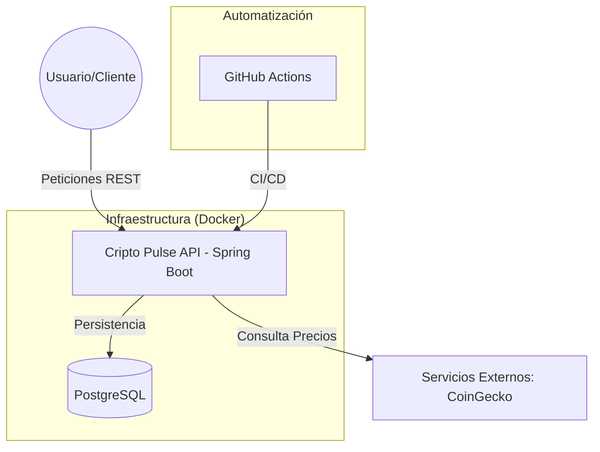
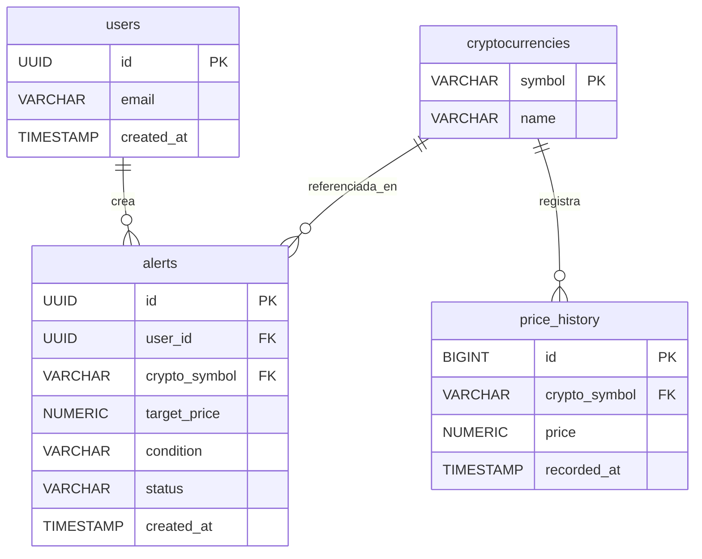

# Cripto Pulse 📈


##  Descripción del Proyecto
**Cripto Pulse** es una plataforma diseñada para resolver la dificultad de monitorear el mercado de criptomonedas de manera sencilla y automatizada. La API permite a pequeños inversionistas y estudiantes realizar un seguimiento de precios en tiempo real, mantener un historial persistente para análisis de tendencias y configurar alertas personalizadas sin depender de plataformas complejas o costosas.

Este proyecto aplica competencias reales de ingeniería, incluyendo el diseño de arquitecturas orientadas a servicios, persistencia de datos relacionales y despliegue automatizado mediante pipelines de CI/CD.

---
##  Plan de Trabajo

- [x] **Fase 1:** Diseño de arquitectura y configuración de repositorio *(Actual)*.
- [x] **Fase 2:** Implementación del modelo de datos y contenedores de base de datos.
- [x] **Fase 3:** Integración con APIs externas y lógica de monitoreo.
- [ ] **Fase 4:** Implementación de alertas y persistencia de historial.
- [ ] **Fase 5:** Automatización de pruebas y configuración de Pipeline CI/CD.

## Edpoins
### 1. Monitoreo de Precios

| Método | Ruta | Parámetros | Descripción | Respuesta (JSON) |
| :--- | :--- | :--- | :--- | :--- |
| **GET** | `/api/v1/prices` | `?symbols=btc,eth` | Obtiene el precio actual de criptos específicas. | `[{"symbol": "BTC", "price": 65000.50}, ...]` |
| **GET** | `/api/v1/prices/{symbol}` | `path: symbol` | Detalle completo de una moneda en particular. | `{"name": "Bitcoin", "symbol": "BTC", "change_24h": 2.5...}` |

### 2. Alertas Personalizadas

| Método | Ruta | Parámetros | Descripción | Respuesta (JSON) |
| :--- | :--- | :--- | :--- | :--- |
| **POST** | `/api/v1/alerts` | **Body:** `symbol, target_price, condition` | Crea una nueva alerta de precio. | `{"id": 1, "status": "active", "created_at": "..."}` |
| **GET** | `/api/v1/alerts` | N/A | Lista todas las alertas configuradas por el usuario. | `[{"id": 1, "symbol": "BTC", "target": 70000}, ...]` |
| **DELETE**| `/api/v1/alerts/{id}` | `path: id` | Elimina una alerta existente. | `204 No Content` |

### 3. Historial y Análisis

| Método | Ruta | Parámetros | Descripción | Respuesta (JSON) |
| :--- | :--- | :--- | :--- | :--- |
| **GET** | `/api/v1/history/{symbol}`| `?from=date&to=date`| Obtiene el historial de precios para gráficas. | `[{"timestamp": "...", "price": 64000}, ...]` |


##  Arquitectura del Sistema

El sistema sigue una arquitectura de capas (N-Tier) y se despliega utilizando contenedores para asegurar la paridad entre los entornos de desarrollo y producción.




### Modelo de Entidad-Relación (ERD)



## 🐳 Fase 3: Despliegue con Docker (Contenedorización)

El proyecto "Cripto Pulse" está completamente contenedorizado utilizando Docker y Docker Compose. Esto garantiza que la API y la base de datos PostgreSQL funcionen de manera idéntica y aislada en cualquier entorno, resolviendo el problema de "en mi máquina sí funciona".

### Requisitos Previos
* Tener [Docker Desktop](https://www.docker.com/products/docker-desktop/) instalado y en ejecución.
* Crear un archivo `.env` en la raíz del proyecto (al mismo nivel que `docker-compose.yml`) con las siguientes credenciales:
  ```env
  DB_NAME=criptopulse
  DB_USER=postgres
  DB_PASSWORD=tu_password_aqui
  API_KEY=tu_api_key_de_coingecko_aqui_o_vacio

### 🚀 Comandos de Ejecución

**1. Construir y levantar los contenedores:**
Ejecuta el siguiente comando en la raíz del proyecto. Esto leerá el `Dockerfile`, compilará la API, descargará la imagen de PostgreSQL y levantará ambos servicios en segundo plano (`-d`).
`bash
docker-compose up --build -d
`

**2. Verificar que la aplicación funciona:**
Para comprobar que los contenedores se construyeron correctamente y están corriendo en su red interna, ejecuta:
`bash
docker-compose ps
`
*(Deberás ver ambos contenedores con el estado `Up`).*

**3. Ver los logs (Opcional):**
Si necesitas ver qué está pasando dentro de la API de Spring Boot en tiempo real:
`bash
docker logs -f criptopulse_api
`

**4. Detener y limpiar los contenedores:**
Cuando termines de utilizar el sistema, puedes apagar los contenedores y liberar los puertos con:
`bash
docker-compose down
`
  


